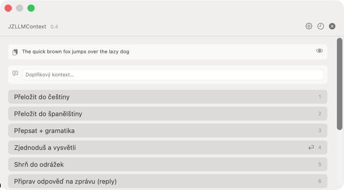
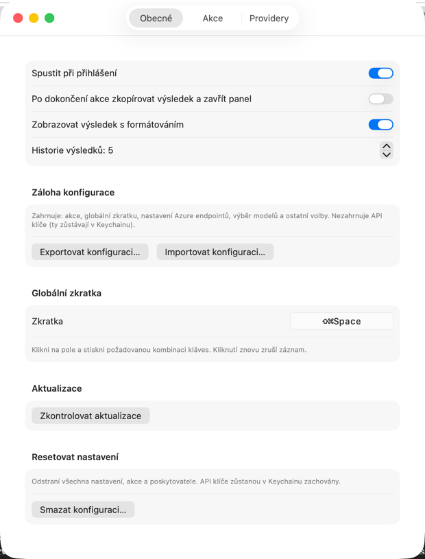
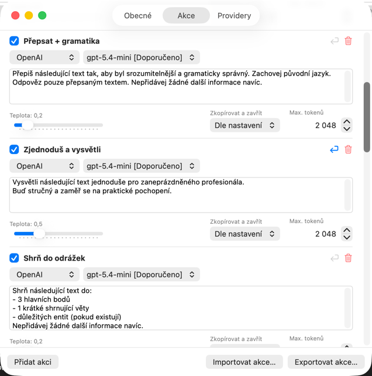
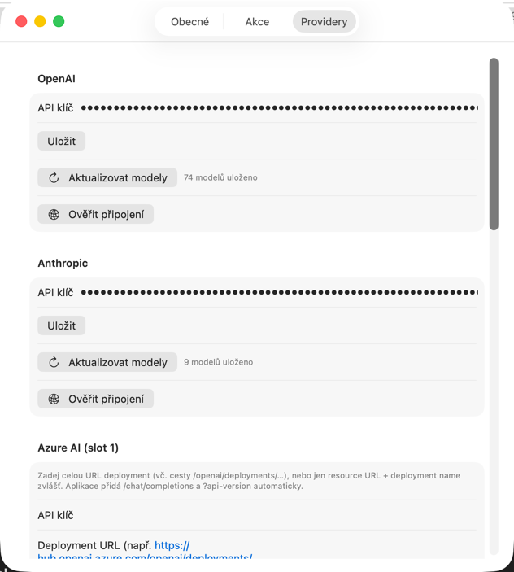

# JZLLMContext

Utilita pro macOS menu bar, která zpracovává obsah schránky pomocí jazykových modelů. Je určena pro každého, kdo při práci pravidelně používá LLM — překladatele, vývojáře, copywritery i běžné uživatele — a chce mít přístup k AI přímo z klávesnice bez přepínání aplikací.

Zkopíruješ text nebo obrázek, stiskneš globální zkratku a vybraná akce pošle obsah do LLM a vrátí výsledek. Každá akce má vlastní systémový prompt, provider a model. Funguje s OpenAI, Anthropic, Azure AI i lokálními modely (Ollama, LM Studio). Všechny akce jsou uživatelsky konfigurovatelné v přirozeném jazyce.



---

## Stažení

Sestavené binárky jsou k dispozici na stránce [GitHub Releases](https://github.com/honzabfu/JZLLMContext/releases/latest) jako `JZLLMContext.zip`.

> **Upozornění — nepodepsaná aplikace**
>
> Aplikace není podepsána vývojářským certifikátem Apple ani notarizována. macOS ji proto zablokuje a zobrazí hlášku „aplikace je poškozena" nebo „nelze ověřit vývojáře". Odblokovej ji jedním z těchto způsobů:
>
> **Terminál (doporučeno):**
> ```bash
> xattr -cr /Applications/JZLLMContext.app
> ```
>
> **Manuálně:** Klikni pravým tlačítkem na `.app` → **Otevřít** → v dialogu potvrď **Otevřít**. Pokud dialog neobsahuje tlačítko Otevřít, přejdi do **Nastavení systému → Soukromí a zabezpečení** a klikni na **Přesto otevřít**.

---

## Obsah

- [Uživatelská příručka](#uživatelská-příručka)
  - [Základní použití](#základní-použití)
  - [Menu bar](#menu-bar)
  - [Overlay panel](#overlay-panel)
  - [Nastavení – Obecné](#nastavení--obecné)
  - [Nastavení – Akce](#nastavení--akce)
  - [Nastavení – Providery](#nastavení--providery)
- [Vlastní modely](#vlastní-modely)
- [Vlastní OpenAI-compatible provider](#vlastní-openai-compatible-provider)
- [Odinstalace](#odinstalace)
- [Technický popis](#technický-popis)
- [Zřeknutí se odpovědnosti](#zřeknutí-se-odpovědnosti)
- [Licence](#licence)

---

## Uživatelská příručka

### Základní použití

1. Označ a zkopíruj text (nebo zkopíruj obrázek s textem do schránky)
2. Stiskni **Cmd+Shift+Space** odkudkoli
3. V overlay panelu uvidíš náhled obsahu schránky a seznam akcí
4. Klikni na tlačítko akce — výsledek se zobrazí pod akcemi
5. Klikni na **Zkopírovat** (nebo **Cmd+C** přímo v panelu) a výsledek máš zpět ve schránce
6. Panel zavřeš klávesou **Escape** nebo tlačítkem ×

### Menu bar

Aplikace žije v menu baru a nevytváří ikonu v Docku.

- **Levé kliknutí** — otevře overlay panel (stejně jako zkratka)
- **Pravé kliknutí** nebo **Option + levé kliknutí** — otevře dropdown menu s možnostmi:
  - O aplikaci JZLLMContext
  - Nastavení… (nebo Cmd+,)
  - Ukončit JZLLMContext

V hlavičce dropdown menu je zobrazena aktuální globální zkratka.

### Overlay panel

Panel je plovoucí okno zobrazené nad ostatními aplikacemi, viditelné na všech plochách i ve fullscreen režimu.

- **Náhled schránky** — zobrazí prvních 300 znaků obsahu (text nebo informaci o OCR)
- **Doplňkový kontext** — volitelné textové pole pro přidání instrukce nad rámec schránky; stiskem **Enter** se spustí výchozí akce; ikona × pro rychlé vymazání
- **Tlačítka akcí** — jen povolené akce
  - Spinner = akce právě běží
  - ⚠ = chybí API klíč pro daný provider
  - Číslo = klávesová zkratka; stisknutí `1`–`9` spustí příslušnou akci bez myši
  - ↩ = výchozí akce (spustí se stiskem Enter v poli kontextu)
  - **Zrušit** — zobrazí se při běžící akci; zastaví požadavek
  - **Pravé tlačítko myši** na akci — kontextové menu: *Spustit* / *Zobrazit prompt* / *Upravit*
- **Ignorování schránky** — tlačítko oka vedle náhledu přepne panel do režimu bez schránky; akce dostanou jako vstup jen doplňkový kontext
- **Oblast výsledku** — zobrazí se po dokončení akce; text lze vybrat myší
- **Tlačítka po dokončení**: **Zkopírovat**, **Zavřít**, při chybě **Zkusit znovu**
- **Historie** — tlačítko hodin v záhlaví; zobrazí poslední výsledky ze session

Nové stisknutí zkratky při otevřeném panelu znovu načte obsah schránky a resetuje výsledek.

### Nastavení – Obecné



- **Spustit při přihlášení** — registruje/odregistruje aplikaci; projeví se okamžitě bez restartu
- **Po dokončení akce zkopírovat výsledek a zavřít panel** — globální přepínač pro automatické zkopírování a zavření po úspěšné akci
- **Zobrazovat výsledek s formátováním** — výsledek se renderuje jako Markdown; při vypnutí jako prostý text
- **Historie výsledků** — počet záznamů uchovávaných do zavření aplikace (0 = vypnuto, max. 10)
- **Zkontrolovat aktualizace** — ověří, zda je dostupná novější verze
- **Záloha konfigurace** — export/import celé konfigurace jako JSON; API klíče nejsou zahrnuty
- **Resetovat nastavení** — obnoví výchozí konfiguraci; API klíče v Keychainu zůstanou zachovány

**Globální zkratka**

Klikni na pole se zkratkou, stiskni požadovanou kombinaci (musí obsahovat alespoň jeden modifikátor) a zkratka se okamžitě uloží. Aktuální zkratka je zobrazena i v hlavičce dropdown menu.

### Nastavení – Akce



Správa akcí zobrazovaných v overlay panelu.

- **Přidání akce** — tlačítko „Přidat akci"
- **Zapnutí/vypnutí** — přepínač vlevo od názvu; vypnuté akce se v overlay nezobrazí
- **Výchozí akce** — tlačítko ↩ označí akci spouštěnou stiskem Enter v poli kontextu; označit lze vždy jen jednu
- **Systémový prompt** — instrukce pro LLM; obsah schránky se posílá jako uživatelská zpráva
- **Provider a model** — výběr providera a modelu (viz [Vlastní modely](#vlastní-modely))
- **Teplota** — slider 0.0–2.0; výchozí 0.7
- **Zkopírovat a zavřít** — per-akce přepis globálního nastavení: *Dle nastavení* / *Vždy* / *Nikdy*
- **Max. tokenů** — maximální délka odpovědi
- **Přesouvání** — drag & drop pro změnu pořadí
- **Mazání** — tlačítko koše s potvrzovacím dialogem
- **Import/export akcí** — sdílení nebo záloha jako JSON

Všechny změny se ukládají okamžitě.

### Nastavení – Providery



**OpenAI a Anthropic** — pole pro API klíč, tlačítko Uložit a **Aktualizovat modely** pro načtení aktuálního seznamu přímo z API.

**Azure AI (slot 1 a slot 2)** — každý slot reprezentuje jedno nasazení (deployment) v Azure AI Foundry. Zadej API klíč, Deployment URL a API verzi.

**Vlastní OpenAI-compatible (slot 1 a slot 2)** — libovolný server kompatibilní s OpenAI Chat Completions API. Zadej Base URL a volitelně API klíč (pro lokální modely lze nechat prázdné).

Tlačítko **Ověřit připojení** u každého providera odešle testovací požadavek a zobrazí výsledek.

---

## Vlastní modely

Každý provider nabízí předdefinovaný seznam modelů a možnost zadat libovolný model:

| Provider | Předdefinované modely |
|----------|----------------------|
| OpenAI | gpt-5.5, gpt-5.4-mini, o4-mini, o3, o3-mini (legacy), gpt-4o, gpt-4o-mini (legacy) |
| Anthropic | claude-sonnet-4.6, claude-opus-4.7, claude-haiku-4.5 |
| Azure AI (slot 1 / slot 2) | — (model určuje deployment v nastavení) |
| Vlastní API (slot 1 / slot 2) | — (jen ruční zadání) |

Výběr vlastního modelu: v nastavení akce otevři výběr modelu → vyber „Vlastní model…" → zadej přesný identifikátor (např. `gpt-4.5-preview`). Hodnota se uloží okamžitě.

---

## Vlastní OpenAI-compatible provider

Aplikace podporuje libovolný server kompatibilní s OpenAI Chat Completions API — v podobě dvou nezávislých slotů.

**Ollama (lokální modely)**
```
Base URL: http://localhost:11434/v1
API klíč: (nechat prázdné)
Model: llama3.2, mistral, ...
```

**LM Studio**
```
Base URL: http://localhost:1234/v1
API klíč: (nechat prázdné nebo libovolný řetězec)
Model: (název modelu načteného v LM Studio)
```

**Jiný cloud provider**
```
Base URL: https://api.together.xyz/v1
API klíč: <tvůj klíč>
Model: meta-llama/Llama-3.2-90B-Vision-Instruct-Turbo
```

---

## Odinstalace

Aplikace nezapisuje do systémových adresářů — veškerá data jsou na třech místech.

| Co | Cesta |
|----|-------|
| Aplikace | tam, kam jsi ji zkopíroval/sestavil, např. `/Applications/JZLLMContext.app` |
| Konfigurační soubor | `~/Library/Application Support/JZLLMContext/config.json` |

```bash
rm -rf ~/Library/"Application Support"/JZLLMContext
```

API klíče jsou uloženy v macOS Keychain pod service `com.jz.JZLLMContext`. Smazání přes **Klíčenka** (Keychain Access) nebo terminál:

```bash
security delete-generic-password -s "com.jz.JZLLMContext" -a "jzllmcontext.openai.apikey"
security delete-generic-password -s "com.jz.JZLLMContext" -a "jzllmcontext.anthropic.apikey"
security delete-generic-password -s "com.jz.JZLLMContext" -a "jzllmcontext.azure_openai.apikey"
security delete-generic-password -s "com.jz.JZLLMContext" -a "jzllmcontext.azure_openai_2.apikey"
security delete-generic-password -s "com.jz.JZLLMContext" -a "jzllmcontext.custom_openai.apikey"
security delete-generic-password -s "com.jz.JZLLMContext" -a "jzllmcontext.custom_openai_2.apikey"
```

Pokud bylo zapnuto „Spustit při přihlášení", odregistruj aplikaci před smazáním přes Nastavení → Obecné. macOS registraci většinou smaže automaticky při odstranění `.app` bundlu.

---

## Technický popis

### Funkce

- **Globální zkratka** — otevře overlay panel s obsahem schránky odkudkoli (výchozí: Cmd+Shift+Space)
- **Text i obrázky** — čte text ze schránky nebo extrahuje text z obrázků přes Apple Vision OCR
- **Více providerů** — OpenAI, Anthropic, Azure AI (2 sloty), vlastní OpenAI-compatible endpoint – 2 sloty (Ollama, LM Studio, …)
- **Vlastní akce** — libovolný počet akcí se systémovými prompty; každá má vlastní provider, model, teplotu a limit tokenů
- **Správa akcí** — zapínání/vypínání, drag & drop řazení, mazání s potvrzením, import/export jako JSON
- **Vlastní modely** — každý provider podporuje zadání libovolného modelu mimo předdefinovaný seznam
- **Klávesové zkratky** — akce 1–9 lze spustit stiskem příslušné číslice přímo v overlay panelu
- **Výchozí akce** — jedna akce může být označena jako výchozí; spustí se stiskem Enter v poli doplňkového kontextu
- **Doplňkový kontext** — volitelné textové pole v overlay pro přidání instrukce nad rámec schránky
- **Ignorování schránky** — tlačítko v overlay přepne do režimu bez schránky; LLM dostane jen doplňkový kontext
- **Proměnné v promptech** — `{{datum}}`, `{{jazyk}}`, `{{kontext}}` se v systémovém promptu nahradí aktuální hodnotou před odesláním
- **Historie výsledků** — session-only; poslední výsledky dostupné přes tlačítko hodin v overlay panelu (0–10 záznamů)
- **Spuštění při přihlášení** — volitelná integrace se Service Management
- **Automatické zkopírování a zavření** — globální přepínač i per-akce přepis (Vždy / Nikdy / Dle nastavení)
- **Formátování výsledku** — globální přepínač; výsledek lze zobrazit s Markdown formátováním nebo jako prostý text
- **Aktualizace seznamu modelů online** — tlačítkem v nastavení providerů lze načíst aktuální modely přímo z API
- **Test připojení** — ověří, zda je API klíč a konfigurace funkční
- **Záloha konfigurace** — export/import celé konfigurace jako JSON; API klíče nejsou exportovány
- **Reset konfigurace** — obnoví výchozí nastavení jedním kliknutím; API klíče v Keychainu zůstanou
- **Kontrola aktualizací** — ověří dostupnost nové verze přes GitHub Releases API
- **Bezpečné uložení klíčů** — API klíče jsou v macOS Keychain, nikoli v konfiguračním souboru

### Požadavky

- macOS 15.0 (Sequoia) nebo novější
- API klíč alespoň jednoho podporovaného providera

### Instalace a sestavení

```bash
# Naklonuj repozitář
git clone https://github.com/honzabfu/JZLLMContext.git
cd JZLLMContext

# Vygeneruj Xcode projekt
brew install xcodegen
xcodegen generate

# Sestav aplikaci
xcodebuild -scheme JZLLMContext -configuration Debug build
```

Sestavená aplikace se nachází v:

```
~/Library/Developer/Xcode/DerivedData/JZLLMContext-*/Build/Products/Debug/JZLLMContext.app
```

### Ikony aplikace

Aplikace hledá tyto PNG soubory v katalogu assetů. Bez nich použije systémový symbol hvězdičky jako zálohu.

| Soubor | Rozměr | Použití |
|--------|--------|---------|
| `Assets.xcassets/MenuBarIcon.imageset/MenuBarIcon.png` | 18×18 px, černobílá | Ikona v menu baru (template) |
| `Assets.xcassets/MenuBarIcon.imageset/MenuBarIcon@2x.png` | 36×36 px, černobílá | Ikona v menu baru @2x |
| `Assets.xcassets/AppColorIcon.imageset/AppColorIcon.png` | min. 64×64 px, barevná | Ikona v dropdown menu |

### Architektura

```
AppDelegate
  ├── HotkeyManager          – registrace globální zkratky přes Carbon API
  ├── OverlayWindowController – správa NSPanel (vytvořen jednou, opakovaně zobrazován)
  │     └── OverlayView       – SwiftUI UI overlay panelu
  │           └── ActionEngine – asynchronní volání LLM (ObservableObject)
  ├── SettingsWindowController – NSWindow + NSHostingView(SettingsView)
  └── AboutWindowController   – NSWindow + NSHostingView(AboutView)

ConfigStore (singleton)       – čtení/zápis config.json
KeychainStore                 – ukládání API klíčů do macOS Keychain
ContextResolver               – čtení NSPasteboard + Vision OCR
ProviderFactory               – vytváření LLMProvider podle konfigurace akce
  ├── OpenAIProvider           – OpenAI + Azure OpenAI (2 sloty) + vlastní endpoint (2 sloty)
  └── AnthropicProvider        – Anthropic Claude
```

Overlay panel se vytvoří jednou při prvním vyvolání a při dalších stisknutích zkratky se pouze znovu zobrazí a aktualizuje obsah schránky přes `OverlayState.refreshID` (UUID trigger). Tím se předchází problémům s macOS window restoration a vícenásobnými okny.

Aplikace je typu LSUIElement (agent) — nemá ikonu v Docku a nevytváří standardní aplikační menu, proto je okno nastavení spravováno ručně přes `NSWindowController` v `AppDelegate`.

### Proměnné v promptech

V systémovém promptu akce lze použít tyto proměnné — před odesláním se nahradí aktuální hodnotou:

| Proměnná | Hodnota |
|----------|---------|
| `{{datum}}` | dnešní datum |
| `{{jazyk}}` | kód jazyka systému (např. `cs`) |
| `{{kontext}}` | obsah pole doplňkového kontextu z overlay panelu; pokud je proměnná v promptu, vloží se přímo tam místo připojení za vstup |

### Ukládání konfigurace

Konfigurace (akce, zkratka, Azure/Custom URL) se ukládá do JSON souboru atomicky (přes dočasný soubor) po každé změně:

```
~/Library/Application Support/JZLLMContext/config.json
```

### Ukládání API klíčů

API klíče jsou uloženy v macOS Keychain pod service `com.jz.JZLLMContext`:

| Provider | Keychain account |
|----------|-----------------|
| OpenAI | `jzllmcontext.openai.apikey` |
| Anthropic | `jzllmcontext.anthropic.apikey` |
| Azure AI slot 1 | `jzllmcontext.azure_openai.apikey` |
| Azure AI slot 2 | `jzllmcontext.azure_openai_2.apikey` |
| Vlastní API slot 1 | `jzllmcontext.custom_openai.apikey` |
| Vlastní API slot 2 | `jzllmcontext.custom_openai_2.apikey` |

### Struktura konfiguračního souboru

```json
{
  "actions": [
    {
      "autoCopyClose": "useGlobal",
      "enabled": true,
      "id": "550e8400-e29b-41d4-a716-446655440000",
      "isDefault": false,
      "maxTokens": 2048,
      "model": "gpt-5.5",
      "name": "Název akce",
      "provider": "openai",
      "systemPrompt": "Systémový prompt…",
      "temperature": 0.7
    }
  ],
  "azureDeploymentName": "muj-deployment",
  "azureEndpoint": "https://muj-hub.openai.azure.com/openai/deployments/muj-model",
  "azureAPIVersion": "2024-10-21",
  "customOpenAIBaseURL": "http://localhost:11434/v1",
  "autoCopyAndClose": false,
  "historyLimit": 5,
  "markdownOutput": true,
  "hotkeyKeyCode": 49,
  "hotkeyModifiers": 768,
  "modelPresets": {},
  "schemaVersion": 1
}
```

Hodnoty `hotkeyKeyCode` a `hotkeyModifiers` jsou kódy Carbon API. Výchozí zkratka Cmd+Shift+Space odpovídá `keyCode: 49`, `modifiers: 768`.

Provider se ukládá jako string: `"openai"`, `"anthropic"`, `"azure_openai"`, `"azure_openai_2"`, `"custom_openai"`, `"custom_openai_2"`.

### Providery a jejich limity

| Provider | Endpoint | Teplota | Poznámka |
|----------|----------|---------|----------|
| OpenAI | `https://api.openai.com/v1/chat/completions` | 0.0–2.0 | Standard Bearer auth |
| Anthropic | `https://api.anthropic.com/v1/messages` | 0.0–1.0 | Teplota oříznutá na 1.0; header `x-api-key` + `anthropic-version: 2023-06-01` |
| Azure AI (slot 1) | `{endpoint}/chat/completions?api-version=...` | 0.0–2.0 | Header `api-key: {key}`; model v body ignorován – model určuje deployment |
| Azure AI (slot 2) | totéž jako slot 1, jiná konfigurace | 0.0–2.0 | Nezávislý slot pro druhý deployment |
| Vlastní API (slot 1) | `{customBaseURL}/chat/completions` | 0.0–2.0 | OpenAI Chat Completions protokol; API klíč i API verze volitelné |
| Vlastní API (slot 2) | totéž jako slot 1, jiná konfigurace | 0.0–2.0 | Nezávislý slot pro druhý custom endpoint |

Timeout všech HTTP požadavků: **60 sekund**.

### OCR pipeline

Při aktivaci overlay panelu aplikace zkontroluje obsah schránky:

1. Pokud schránka obsahuje text → použije se přímo
2. Pokud schránka obsahuje obrázek → spustí se Apple Vision OCR (`VNRecognizeTextRequest`, `recognitionLevel: .accurate`); bloky seřazeny shora dolů a spojeny `\n`
3. Pokud je schránka prázdná → zobrazí se chybová zpráva

### Globální zkratka

Zkratka je registrována přes Carbon `RegisterEventHotKey` s identifikátorem `JZLC`. Při změně se provede `unregister()` → `register()` se novými hodnotami; změna se šíří přes `NotificationCenter` (`hotkeyDidChange`).

---

## Zřeknutí se odpovědnosti

Software je poskytován **„tak jak je"** (as is), bez záruky jakéhokoliv druhu — výslovné ani předpokládané. Používáte jej **na vlastní riziko**. Autor ani přispěvatelé neodpovídají za žádné přímé ani nepřímé škody vzniklé použitím nebo nemožností použití tohoto softwaru. Software může obsahovat chyby.

---

## Licence

[MIT](LICENSE) © 2026 Jan Zak
