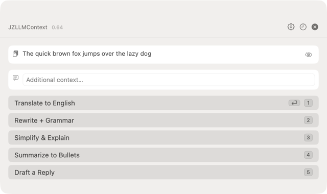
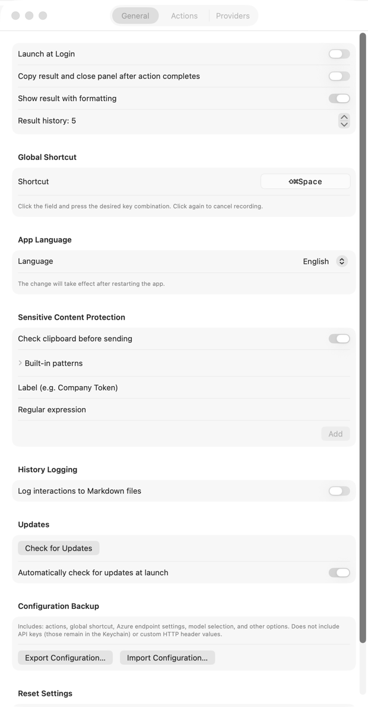
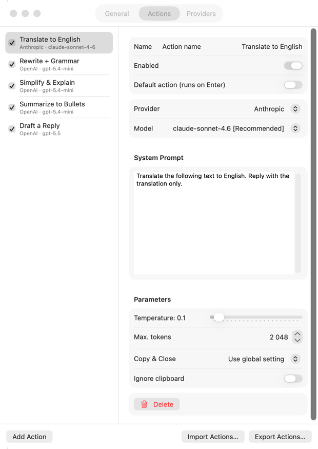
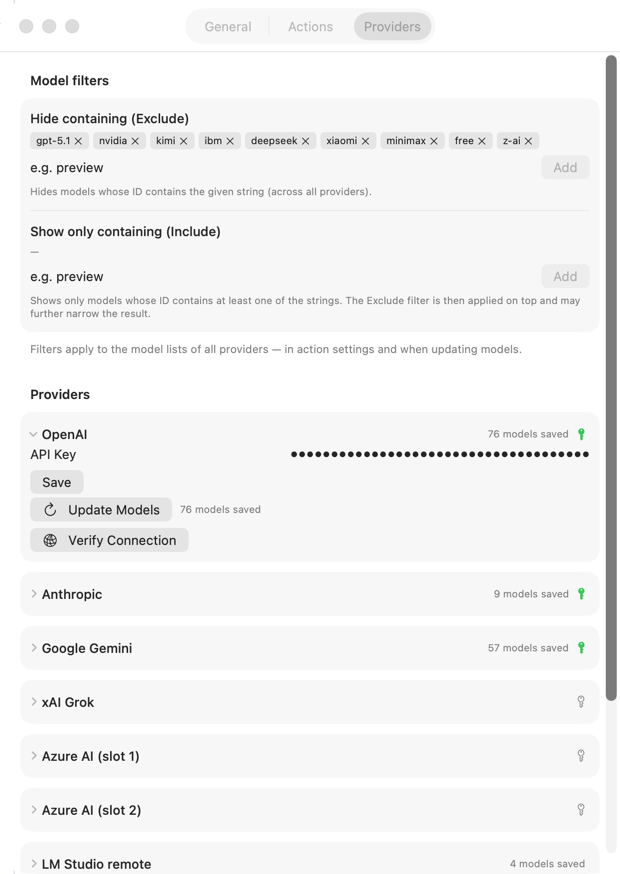
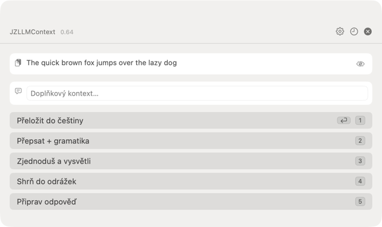
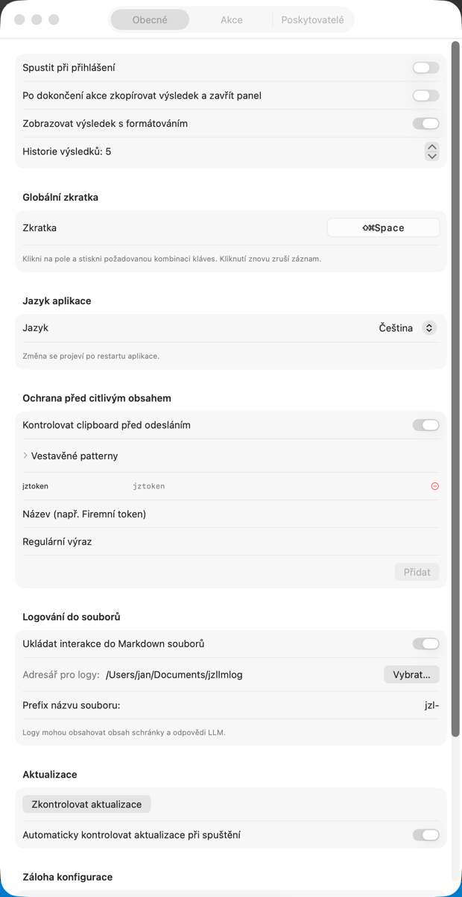
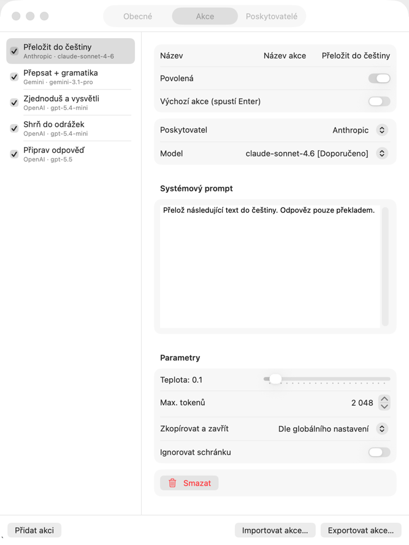
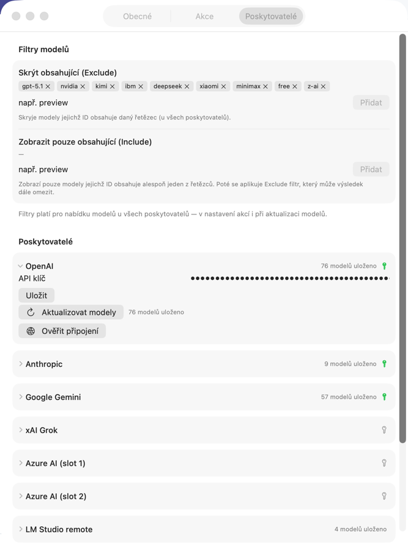

# JZLLMContext

[🇺🇸 English](#english) · [🇨🇿 Čeština](#čeština)

---

## English

A macOS menu bar utility that processes clipboard content using language models. Designed for anyone who regularly uses LLMs while working – translators, developers, copywriters, and everyday users – who want AI accessible directly from the keyboard without switching apps.

Copy text or an image, press the global shortcut, and the selected action sends the content to an LLM and returns the result. Each action has its own system prompt, provider, and model. Works with OpenAI, Anthropic, Google Gemini, xAI Grok, Azure AI, and local models (Ollama, LM Studio). All actions are fully configurable.



---

### Contents

- [Download](#download)
- [User Guide](#user-guide)
  - [Basic Usage](#basic-usage)
  - [Menu Bar](#menu-bar)
  - [Overlay Panel](#overlay-panel)
  - [Settings – General](#settings--general)
  - [Settings – Actions](#settings--actions)
  - [Settings – Providers](#settings--providers)
- [Custom Models](#custom-models)
- [Custom OpenAI-Compatible Providers](#custom-openai-compatible-providers)
- [Uninstalling](#uninstalling)
- [Technical Overview](#technical-overview)
- [Disclaimer](#disclaimer)
- [License](#license)

---

### Download

Pre-built binaries are available on the [GitHub Releases](https://github.com/honzabfu/JZLLMContext/releases/latest) page as `JZLLMContext.zip`.

> **Notice – unsigned application**
>
> The app is not signed with an Apple Developer certificate or notarized. macOS will therefore block it and show a message saying the app is "damaged" or the developer cannot be verified. Unblock it using one of the following methods:
>
> **Terminal (recommended):**
> ```bash
> xattr -cr /Applications/JZLLMContext.app
> ```
>
> **Manually:** Right-click the `.app` → **Open** → confirm **Open** in the dialog. If the dialog does not show an Open button, go to **System Settings → Privacy & Security** and click **Open Anyway**.

---

### User Guide

#### Basic Usage

1. Select and copy text (or copy an image containing text to the clipboard)
2. Press **Cmd+Shift+Space** from anywhere
3. The overlay panel shows a preview of the clipboard content and a list of actions
4. Click an action button – the result appears below the actions
5. Click **Copy** (or **Cmd+C** directly in the panel) to put the result back in the clipboard
6. Close the panel with **Escape** or the × button

#### Menu Bar

The app lives in the menu bar and does not create a Dock icon.

- **Left click** – opens the overlay panel (same as the shortcut)
- **Right click** or **Option + left click** – opens the dropdown menu with:
  - About JZLLMContext
  - Settings… (or Cmd+,)
  - Quit JZLLMContext

The current global shortcut is shown in the dropdown menu header.

When a new version is detected at launch or via manual check, a **⬆ Version X.Y available…** item appears in the dropdown – clicking it opens the GitHub Releases page.

#### Overlay Panel

The panel is a floating window displayed above all other apps, visible on all Spaces and in fullscreen mode.

- **Clipboard preview** – shows the first 300 characters of the content (text or OCR status)
- **Additional context** – optional text field for adding instructions beyond the clipboard content; pressing **Enter** triggers the default action; × icon clears the field
- **Action buttons** – only enabled actions are shown
  - Spinner = action is running
  - ⚠ = API key missing for the action's provider
  - Number = keyboard shortcut; pressing `1`–`9` runs the corresponding action without the mouse
  - ↩ = default action (triggered by Enter in the context field)
  - **Cancel** – shown while an action is running; stops the request
  - **Right-click** on an action – context menu: *Run* / *View Prompt* / *Edit*
- **Clipboard ignore** – the eye button next to the preview toggles clipboard-free mode; actions receive only the additional context as input
- **Clipboard change indicator** – if the clipboard content changes while the panel is open, a blue refresh icon appears below the eye button; clicking it reloads the clipboard content
- **Result area** – shown after an action completes; text can be selected with the mouse
- **Post-completion buttons**: **Copy**, **Close**, and **Retry** on error
- **History** – the clock button in the header shows recent results from the current session; when interaction logging is enabled, an **Open log folder** button appears at the bottom of the history panel

Pressing the shortcut again while the panel is open reloads the clipboard content and resets the result.

#### Settings – General



- **Launch at Login** – registers/unregisters the app; takes effect immediately without restart
- **Copy result and close panel after action completes** – global toggle for automatic copy and close after a successful action
- **Show result with formatting** – renders the result as Markdown; plain text when disabled
- **Result history** – number of results kept until the app closes (0 = disabled, max 10)
- **Check for Updates** – checks whether a newer version is available
- **Automatically check for updates at launch** – enables/disables the automatic version check on every launch
- **Log interactions to Markdown files** – opt-in; when enabled, every completed action is appended to a dated `.md` file (`YYYY-MM-DD.md`) in the directory you choose; each entry contains the action name, model, input, and response. An optional **File name prefix** is prepended to the file name. A sensitive-data warning is shown the first time you enable this feature.
- **Sensitive Content Detection** – enabled by default; scans clipboard text against built-in and custom regex patterns (API keys, tokens, private keys) before sending to the LLM. If a match is found, a confirmation sheet lists the matched values so you can cancel or send anyway. Custom patterns (label + regex) can be added in Settings; built-in patterns cover OpenAI, Anthropic, Google, GitHub, AWS keys, Bearer tokens, and private keys.
- **Configuration Backup** – export/import the full configuration as JSON; API keys are not included
- **Reset Settings** – restores the default configuration; API keys in the Keychain are preserved

**Global Shortcut**

Click the shortcut field, press the desired key combination (must include at least one modifier key), and the shortcut is saved immediately. The current shortcut is also shown in the dropdown menu header.

#### Settings – Actions



Manage the actions shown in the overlay panel.

- **Add action** – "Add Action" button
- **Enable/disable** – toggle to the left of the name; disabled actions do not appear in the overlay
- **Default action** – the ↩ button marks the action triggered by pressing Enter in the context field; only one action can be marked at a time
- **System prompt** – instructions for the LLM; clipboard content is sent as the user message
- **Provider and model** – select provider and model (see [Custom Models](#custom-models))
- **Temperature** – slider 0.0–2.0; default 0.7
- **Copy & Close** – per-action override of the global setting: *Use global setting* / *Always* / *Never*
- **Max. tokens** – maximum response length
- **Reordering** – drag & drop to change the order
- **Delete** – trash button with a confirmation dialog
- **Import/export actions** – share or back up actions as JSON

All changes are saved immediately.

#### Settings – Providers



**OpenAI, Anthropic, Google Gemini, xAI Grok** – API key field, Save button, and **Update Models** to fetch the current model list directly from the API.

**Azure AI (slot 1 and slot 2)** – each slot represents one deployment in Azure AI Foundry. Enter the API key, Deployment URL, and API version.

**Custom OpenAI-compatible providers** – any number of custom providers compatible with the OpenAI Chat Completions API. Add a provider with the **+** button and configure: provider name (used in the action picker and all UI), Base URL, optionally an API key (leave empty for local models), optionally an **API version** (appends `?api-version=…` to the URL), the **Max tokens parameter** (`max_tokens`, `max_completion_tokens`, `max_output_tokens`, `max_new_tokens` – select based on what the server expects), and optional **Custom Headers** (extra HTTP headers sent with every request – useful for authentication headers, API routing, or service-specific requirements). **Update Models** fetches the model list from the server's `/models` endpoint (compatible with Ollama, LM Studio, and most OpenAI-compatible servers); manual model entry per action always remains available. Providers can be removed with the delete button; actions using the deleted provider are automatically reset to OpenAI.

**Model Filters** – global filters that apply across all providers. The **Exclude** list hides any model whose ID contains one of the specified strings (e.g. adding `preview` hides all preview models). The **Include** list, when non-empty, shows only models whose ID contains at least one of the specified strings. Include takes priority over exclude. Filters apply in the action model picker and in the Update Models sheet.

The **Verify Connection** button for each provider sends a test request and displays the result.

---

### Custom Models

Each provider offers a predefined model list and the option to enter any model manually:

| Provider | Predefined models |
|----------|------------------|
| OpenAI | gpt-5.5, gpt-5.4-mini, o4-mini (legacy), o3 (legacy), o3-mini (legacy), gpt-4o (legacy), gpt-4o-mini (legacy) |
| Anthropic | claude-sonnet-4.6, claude-opus-4.7, claude-haiku-4.5 |
| Google Gemini | gemini-2.5-pro, gemini-2.5-flash, gemini-2.0-flash (legacy) |
| xAI Grok | grok-3, grok-3-mini, grok-2 (legacy) |
| Azure AI (slot 1 / slot 2) | – (model is determined by the deployment configuration) |
| Custom providers | fetched via Update Models (if server supports `/models`); manual entry always available |

To use a custom model: in the action settings, open the model picker → select "Custom model…" → enter the exact model identifier (e.g. `gpt-4.5-preview`). The value is saved immediately.

---

### Custom OpenAI-Compatible Providers

The app supports any number of custom providers compatible with the OpenAI Chat Completions API. Add them in **Settings → Providers** using the **+** button. Each provider has an independent name, API key, and configuration.

**Ollama (local models)**
```
Name:     Ollama
Base URL: http://localhost:11434/v1
API key:  (leave empty)
Model:    llama3.2, mistral, ...
```

**LM Studio**
```
Name:     LM Studio
Base URL: http://localhost:1234/v1
API key:  (leave empty or any string)
Model:    (name of the model loaded in LM Studio)
```

**Another cloud provider (e.g. Together AI)**
```
Name:     Together AI
Base URL: https://api.together.xyz/v1
API key:  <your key>
Model:    meta-llama/Llama-3.2-90B-Vision-Instruct-Turbo
```

**OpenRouter (with custom headers)**
```
Name:           OpenRouter
Base URL:       https://openrouter.ai/api/v1
API key:        <your OpenRouter key>
Custom Headers: HTTP-Referer: https://your-app.example.com
                X-Title: YourAppName
Model:          (any OpenRouter model ID)
```

---

### Uninstalling

The app does not write to system directories – all data is in two locations.

| What | Path |
|------|------|
| App | wherever you copied/built it, e.g. `/Applications/JZLLMContext.app` |
| Configuration file | `~/Library/Application Support/JZLLMContext/config.json` |

```bash
rm -rf ~/Library/"Application Support"/JZLLMContext
```

If you have enabled history logging (Settings → General), conversation logs are saved to the directory you configured. Delete that folder manually.

API keys are stored in the macOS Keychain under service `com.jz.JZLLMContext`. Delete them via **Keychain Access** or the terminal:

```bash
security delete-generic-password -s "com.jz.JZLLMContext" -a "jzllmcontext.openai.apikey"
security delete-generic-password -s "com.jz.JZLLMContext" -a "jzllmcontext.anthropic.apikey"
security delete-generic-password -s "com.jz.JZLLMContext" -a "jzllmcontext.gemini.apikey"
security delete-generic-password -s "com.jz.JZLLMContext" -a "jzllmcontext.grok.apikey"
security delete-generic-password -s "com.jz.JZLLMContext" -a "jzllmcontext.azure_openai.apikey"
security delete-generic-password -s "com.jz.JZLLMContext" -a "jzllmcontext.azure_openai_2.apikey"
# For each custom provider, replace <uuid> with the provider's UUID from config.json:
security delete-generic-password -s "com.jz.JZLLMContext" -a "jzllmcontext.<uuid>.apikey"
```

If "Launch at Login" was enabled, unregister the app in Settings → General before deleting it. macOS usually removes the registration automatically when the `.app` bundle is deleted.

---

### Technical Overview

#### Features

- **Global shortcut** – opens the overlay panel with clipboard content from anywhere (default: Cmd+Shift+Space)
- **Text and images** – reads text from the clipboard or extracts text from images via Apple Vision OCR
- **Multiple providers** – OpenAI, Anthropic, Google Gemini, xAI Grok, Azure AI (2 slots), unlimited custom OpenAI-compatible providers (Ollama, LM Studio, OpenRouter, …)
- **Custom actions** – any number of actions with system prompts; each has its own provider, model, temperature, and token limit
- **Action management** – enable/disable, drag & drop reordering, delete with confirmation, import/export as JSON
- **Custom models** – each provider supports entering any model beyond the predefined list
- **Keyboard shortcuts** – actions 1–9 can be triggered by pressing the corresponding digit directly in the overlay panel
- **Default action** – one action can be marked as default; it is triggered by pressing Enter in the additional context field
- **Additional context** – optional text field in the overlay for adding instructions beyond the clipboard content
- **Clipboard ignore** – a button in the overlay switches to clipboard-free mode; the LLM receives only the additional context
- **Clipboard change detection** – while the panel is open, the app monitors the clipboard; a blue refresh icon appears if the content changes, allowing instant reload
- **Prompt variables** – `{{datum}}`, `{{jazyk}}`, `{{kontext}}` are replaced with their current values before sending (note: variable names are in Czech)
- **Result history** – session-only; recent results accessible via the clock button in the overlay panel (0–10 entries)
- **Launch at Login** – optional Service Management integration
- **Auto copy and close** – global toggle and per-action override (Always / Never / Use global setting)
- **Result formatting** – global toggle; result can be shown with Markdown formatting or as plain text
- **Online model list refresh** – fetch current models directly from the API via the provider settings button; custom OpenAI-compatible providers query the server's `/models` endpoint
- **Model filters** – global include and exclude filter lists; models whose ID contains an exclude string are hidden across all providers; if any include strings are set, only matching models are shown; filters apply in the model picker and the Update Models sheet
- **Custom HTTP headers** – each custom provider can send arbitrary extra HTTP headers with every request (useful for API routing, authentication, or service-specific requirements like `HTTP-Referer` on OpenRouter)
- **Connection test** – verifies that the API key and configuration are working
- **Configuration backup** – export/import the full configuration as JSON; API keys are not exported
- **Configuration reset** – restore default settings with one click; API keys in the Keychain are preserved
- **Interaction logging** – opt-in; appends each completed action (action name, model, input, response) to a dated Markdown file in a user-defined directory; optional file name prefix; sensitive-data warning on first enable
- **Sensitive content detection** – regex scanner that checks clipboard text against built-in patterns (OpenAI/Anthropic/Google/GitHub/AWS API keys, Bearer tokens, private keys) and user-defined label+regex patterns before sending to the LLM; a confirmation sheet shows matched values and requires explicit approval; patterns persist in the configuration
- **Update check** – manual button in settings and optional automatic check at launch with ETag-based caching (avoids redundant GitHub API calls); new version appears as a dropdown menu item
- **Secure key storage** – API keys are stored in the macOS Keychain, not in the configuration file

#### Requirements

- macOS 15.0 (Sequoia) or later
- API key for at least one supported provider

#### Building from Source

```bash
# Clone the repository
git clone https://github.com/honzabfu/JZLLMContext.git
cd JZLLMContext

# Generate the Xcode project
brew install xcodegen
xcodegen generate

# Build the app
xcodebuild -scheme JZLLMContext -configuration Debug build
```

The built app is located at:

```
~/Library/Developer/Xcode/DerivedData/JZLLMContext-*/Build/Products/Debug/JZLLMContext.app
```

#### App Icons

The app looks for these PNG files in the asset catalog. Without them it falls back to a system star symbol.

| File | Size | Usage |
|------|------|-------|
| `Assets.xcassets/MenuBarIcon.imageset/MenuBarIcon.png` | 18×18 px, black & white | Menu bar icon (template) |
| `Assets.xcassets/MenuBarIcon.imageset/MenuBarIcon@2x.png` | 36×36 px, black & white | Menu bar icon @2x |
| `Assets.xcassets/AppColorIcon.imageset/AppColorIcon.png` | min. 64×64 px, color | Icon in the dropdown menu |

#### Architecture

```
AppDelegate
  ├── HotkeyManager          – global shortcut registration via Carbon API
  ├── OverlayWindowController – NSPanel management (created once, shown repeatedly)
  │     └── OverlayView       – SwiftUI overlay panel UI
  │           └── ActionEngine – async LLM calls (ObservableObject)
  ├── SettingsWindowController – NSWindow + NSHostingView(SettingsView)
  └── AboutWindowController   – NSWindow + NSHostingView(AboutView)

ConfigStore (singleton)       – read/write config.json
KeychainStore                 – store API keys in macOS Keychain
ContextResolver               – read NSPasteboard + Vision OCR
ProviderFactory               – create LLMProvider based on action config
  ├── OpenAIProvider           – OpenAI + Azure OpenAI (2 slots) + dynamic custom endpoints
  └── AnthropicProvider        – Anthropic Claude
```

The overlay panel is created once on first invocation and on subsequent shortcut presses it is simply shown again and the clipboard content is refreshed via `OverlayState.refreshID` (UUID trigger). This avoids issues with macOS window restoration and multiple windows.

The app is an LSUIElement (agent) – no Dock icon and no standard app menu bar, so the settings window is managed manually via `NSWindowController` in `AppDelegate`.

#### Prompt Variables

The following variables can be used in action system prompts – they are replaced with their current value before sending:

| Variable | Value |
|----------|-------|
| `{{datum}}` | today's date |
| `{{jazyk}}` | system language code (e.g. `en`) |
| `{{kontext}}` | content of the additional context field in the overlay panel; if the variable is present in the prompt, the context is inserted at that position instead of being appended to the input |

> Note: Variable names are in Czech and fixed in the source code.

#### Configuration Storage

Configuration (actions, shortcut, Azure/Custom URLs) is saved atomically to a JSON file after every change:

```
~/Library/Application Support/JZLLMContext/config.json
```

#### API Key Storage

API keys are stored in the macOS Keychain under service `com.jz.JZLLMContext`:

| Provider | Keychain account |
|----------|-----------------|
| OpenAI | `jzllmcontext.openai.apikey` |
| Anthropic | `jzllmcontext.anthropic.apikey` |
| Google Gemini | `jzllmcontext.gemini.apikey` |
| xAI Grok | `jzllmcontext.grok.apikey` |
| Azure AI slot 1 | `jzllmcontext.azure_openai.apikey` |
| Azure AI slot 2 | `jzllmcontext.azure_openai_2.apikey` |
| Custom provider | `jzllmcontext.<uuid>.apikey` (UUID is assigned per provider on creation) |

#### Configuration File Structure

```json
{
  "actions": [
    {
      "autoCopyClose": "useGlobal",
      "enabled": true,
      "id": "550e8400-e29b-41d4-a716-446655440000",
      "isDefault": false,
      "maxTokens": 2048,
      "model": "gpt-5.5",
      "name": "Action name",
      "provider": "openai",
      "systemPrompt": "System prompt…",
      "temperature": 0.7
    }
  ],
  "azureDeploymentName": "my-deployment",
  "azureEndpoint": "https://my-hub.openai.azure.com/openai/deployments/my-model",
  "azureAPIVersion": "2024-10-21",
  "azureDeploymentName2": null,
  "azureEndpoint2": null,
  "azureAPIVersion2": null,
  "customProviders": [
    {
      "id": "a1b2c3d4-e5f6-7890-abcd-ef1234567890",
      "name": "Ollama",
      "baseURL": "http://localhost:11434/v1",
      "apiVersion": null,
      "tokenParamStyle": "max_tokens",
      "requiresAPIKey": false,
      "customHeaders": {}
    },
    {
      "id": "b2c3d4e5-f6a7-8901-bcde-f12345678901",
      "name": "OpenRouter",
      "baseURL": "https://openrouter.ai/api/v1",
      "apiVersion": null,
      "tokenParamStyle": "max_tokens",
      "requiresAPIKey": true,
      "customHeaders": {
        "HTTP-Referer": "https://your-app.example.com"
      }
    }
  ],
  "modelExcludeFilters": ["preview", "instruct"],
  "modelIncludeFilters": [],
  "autoUpdateCheck": true,
  "autoCopyAndClose": false,
  "historyLimit": 5,
  "markdownOutput": true,
  "hotkeyKeyCode": 49,
  "hotkeyModifiers": 768,
  "modelPresets": {},
  "schemaVersion": 2
}
```

`hotkeyKeyCode` and `hotkeyModifiers` are Carbon API codes. The default shortcut Cmd+Shift+Space corresponds to `keyCode: 49`, `modifiers: 768`.

Provider is stored as a string: `"openai"`, `"anthropic"`, `"gemini"`, `"grok"`, `"azure_openai"`, `"azure_openai_2"`, or the UUID string of a custom provider (e.g. `"a1b2c3d4-e5f6-7890-abcd-ef1234567890"`).

#### Providers and Their Details

| Provider | Endpoint | Temperature | Notes |
|----------|----------|-------------|-------|
| OpenAI | `https://api.openai.com/v1/chat/completions` | 0.0–2.0 | Standard Bearer auth |
| Anthropic | `https://api.anthropic.com/v1/messages` | 0.0–1.0 | Temperature capped at 1.0; `x-api-key` header + `anthropic-version: 2023-06-01` |
| Google Gemini | `https://generativelanguage.googleapis.com/v1beta/openai/chat/completions` | 0.0–2.0 | OpenAI-compatible endpoint; Bearer auth |
| xAI Grok | `https://api.x.ai/v1/chat/completions` | 0.0–2.0 | OpenAI-compatible endpoint; Bearer auth |
| Azure AI (slot 1) | `{endpoint}/chat/completions?api-version=...` | 0.0–2.0 | `api-key: {key}` header; model in body is ignored – model is determined by the deployment |
| Azure AI (slot 2) | same as slot 1, different config | 0.0–2.0 | Independent slot for a second deployment |
| Custom provider (any) | `{baseURL}/chat/completions` | 0.0–2.0 | OpenAI Chat Completions protocol; API key, API version, and custom headers are all optional; supports Ollama, LM Studio, OpenRouter, Together AI, etc. |

All HTTP requests time out after **60 seconds**.

#### OCR Pipeline

When the overlay panel is activated, the app checks the clipboard:

1. If the clipboard contains text → used directly
2. If the clipboard contains an image → Apple Vision OCR is triggered (`VNRecognizeTextRequest`, `recognitionLevel: .accurate`); blocks are sorted top-to-bottom and joined with `\n`
3. If the clipboard is empty → an error message is shown

#### Global Shortcut

The shortcut is registered via Carbon `RegisterEventHotKey` with identifier `JZLC`. On change, `unregister()` is called followed by `register()` with the new values; the change is propagated via `NotificationCenter` (`hotkeyDidChange`).

---

### Disclaimer

This software is provided **"as is"**, without warranty of any kind – express or implied. You use it **at your own risk**. The author and contributors are not responsible for any direct or indirect damages arising from the use or inability to use this software. The software may contain bugs.

---

### License

[MIT](LICENSE) © 2026 Jan Zak

---

## Čeština

Utilita pro macOS menu bar, která zpracovává obsah schránky pomocí různých jazykových modelů. Je určena pro každého, kdo při práci pravidelně používá LLM – překladatele, vývojáře, copywritery i běžné uživatele – a chce mít přístup k AI přímo z klávesnice bez přepínání aplikací.

Zkopíruješ text nebo obrázek, stiskneš globální zkratku a vybraná akce pošle obsah do LLM a vrátí výsledek. Každá akce má vlastní systémový prompt, provider a model. Funguje s OpenAI, Anthropic, Google Gemini, xAI Grok, Azure AI i lokálními modely (Ollama, LM Studio). Všechny akce jsou uživatelsky konfigurovatelné.



---

### Obsah

- [Stažení](#stažení)
- [Uživatelská příručka](#uživatelská-příručka)
  - [Základní použití](#základní-použití)
  - [Menu bar](#menu-bar-1)
  - [Overlay panel](#overlay-panel-1)
  - [Nastavení – Obecné](#nastavení--obecné)
  - [Nastavení – Akce](#nastavení--akce)
  - [Nastavení – Providery](#nastavení--providery)
- [Vlastní modely](#vlastní-modely)
- [Vlastní OpenAI-compatible providery](#vlastní-openai-compatible-providery)
- [Odinstalace](#odinstalace)
- [Technický popis](#technický-popis)
- [Zřeknutí se odpovědnosti](#zřeknutí-se-odpovědnosti)
- [Licence](#licence-1)

---

### Stažení

Sestavené binárky jsou k dispozici na stránce [GitHub Releases](https://github.com/honzabfu/JZLLMContext/releases/latest) jako `JZLLMContext.zip`.

> **Upozornění – nepodepsaná aplikace**
>
> Aplikace není podepsána vývojářským certifikátem Apple ani notarizována. macOS ji proto zablokuje a zobrazí hlášku „aplikace je poškozena" nebo „nelze ověřit vývojáře". Odblokovej ji jedním z těchto způsobů:
>
> **Terminál (doporučeno):**
> ```bash
> xattr -cr /Applications/JZLLMContext.app
> ```
>
> **Manuálně:** Klikni pravým tlačítkem na `.app` → **Otevřít** → v dialogu potvrď **Otevřít**. Pokud dialog neobsahuje tlačítko Otevřít, přejdi do **Nastavení systému → Soukromí a zabezpečení** a klikni na **Přesto otevřít**.

---

### Uživatelská příručka

#### Základní použití

1. Označ a zkopíruj text (nebo zkopíruj obrázek s textem do schránky)
2. Stiskni **Cmd+Shift+Space** odkudkoli
3. V overlay panelu uvidíš náhled obsahu schránky a seznam akcí
4. Klikni na tlačítko akce – výsledek se zobrazí pod akcemi
5. Klikni na **Zkopírovat** (nebo **Cmd+C** přímo v panelu) a výsledek máš zpět ve schránce
6. Panel zavřeš klávesou **Escape** nebo tlačítkem ×

#### Menu bar

Aplikace žije v menu baru a nevytváří ikonu v Docku.

- **Levé kliknutí** – otevře overlay panel (stejně jako zkratka)
- **Pravé kliknutí** nebo **Option + levé kliknutí** – otevře dropdown menu s možnostmi:
  - O aplikaci JZLLMContext
  - Nastavení… (nebo Cmd+,)
  - Ukončit JZLLMContext

V hlavičce dropdown menu je zobrazena aktuální globální zkratka.

Pokud je při spuštění nebo ruční kontrole zjištěna nová verze, zobrazí se v dropdown menu položka **⬆ Dostupná verze X.Y…** – kliknutím se otevře stránka GitHub Releases.

#### Overlay panel

Panel je plovoucí okno zobrazené nad ostatními aplikacemi, viditelné na všech plochách i ve fullscreen režimu.

- **Náhled schránky** – zobrazí prvních 300 znaků obsahu (text nebo informaci o OCR)
- **Doplňkový kontext** – volitelné textové pole pro přidání instrukce nad rámec schránky; stiskem **Enter** se spustí výchozí akce; ikona × pro rychlé vymazání
- **Tlačítka akcí** – jen povolené akce
  - Spinner = akce právě běží
  - ⚠ = chybí API klíč pro daný provider
  - Číslo = klávesová zkratka; stisknutí `1`–`9` spustí příslušnou akci bez myši
  - ↩ = výchozí akce (spustí se stiskem Enter v poli kontextu)
  - **Zrušit** – zobrazí se při běžící akci; zastaví požadavek
  - **Pravé tlačítko myši** na akci – kontextové menu: *Spustit* / *Zobrazit prompt* / *Upravit*
- **Ignorování schránky** – tlačítko oka vedle náhledu přepne panel do režimu bez schránky; akce dostanou jako vstup jen doplňkový kontext
- **Indikátor změny schránky** – pokud se obsah schránky změní při otevřeném panelu, pod tlačítkem oka se zobrazí modrá ikona obnovení; kliknutím se znovu načte obsah schránky
- **Oblast výsledku** – zobrazí se po dokončení akce; text lze vybrat myší
- **Tlačítka po dokončení**: **Zkopírovat**, **Zavřít**, při chybě **Zkusit znovu**
- **Historie** – tlačítko hodin v záhlaví; zobrazí poslední výsledky ze session; pokud je zapnuto logování interakcí, zobrazí se na konci panelu tlačítko **Otevřít složku logů**

Nové stisknutí zkratky při otevřeném panelu znovu načte obsah schránky a resetuje výsledek.

#### Nastavení – Obecné



- **Spustit při přihlášení** – registruje/odregistruje aplikaci; projeví se okamžitě bez restartu
- **Po dokončení akce zkopírovat výsledek a zavřít panel** – globální přepínač pro automatické zkopírování a zavření po úspěšné akci
- **Zobrazovat výsledek s formátováním** – výsledek se renderuje jako Markdown; při vypnutí jako prostý text
- **Historie výsledků** – počet záznamů uchovávaných do zavření aplikace (0 = vypnuto, max. 10)
- **Zkontrolovat aktualizace** – ověří, zda je dostupná novější verze
- **Automaticky kontrolovat aktualizace při spuštění** – zapíná/vypíná automatickou kontrolu nové verze při každém spuštění aplikace
- **Ukládat interakce do Markdown souborů** – opt-in; při zapnutí se každá dokončená akce zapíše do datovaného souboru `.md` (`YYYY-MM-DD.md`) ve zvoleném adresáři; každý záznam obsahuje název akce, model, vstup a odpověď. Volitelný **Prefix názvu souboru** se přidá na začátek názvu souboru. Při prvním zapnutí se zobrazí upozornění na citlivá data.
- **Detekce citlivého obsahu** – výchozí stav zapnuto; před odesláním textu ze schránky do LLM zkontroluje obsah vůči vestavěným i vlastním regex vzorům (API klíče, tokeny, privátní klíče). Pokud je nalezena shoda, zobrazí se potvrzovací dialog se seznamem nalezených hodnot – lze zrušit nebo odeslat přesto. Vlastní vzory (název + regex) lze přidávat v Nastavení; vestavěné vzory pokrývají klíče OpenAI, Anthropic, Google, GitHub, AWS, Bearer tokeny a privátní klíče.
- **Záloha konfigurace** – export/import celé konfigurace jako JSON; API klíče nejsou zahrnuty
- **Resetovat nastavení** – obnoví výchozí konfiguraci; API klíče v Keychainu zůstanou zachovány

**Globální zkratka**

Klikni na pole se zkratkou, stiskni požadovanou kombinaci (musí obsahovat alespoň jeden modifikátor) a zkratka se okamžitě uloží. Aktuální zkratka je zobrazena i v hlavičce dropdown menu.

#### Nastavení – Akce



Správa akcí zobrazovaných v overlay panelu.

- **Přidání akce** – tlačítko „Přidat akci"
- **Zapnutí/vypnutí** – přepínač vlevo od názvu; vypnuté akce se v overlay nezobrazí
- **Výchozí akce** – tlačítko ↩ označí akci spouštěnou stiskem Enter v poli kontextu; označit lze vždy jen jednu
- **Systémový prompt** – instrukce pro LLM; obsah schránky se posílá jako uživatelská zpráva
- **Provider a model** – výběr providera a modelu (viz [Vlastní modely](#vlastní-modely))
- **Teplota** – slider 0.0–2.0; výchozí 0.7
- **Zkopírovat a zavřít** – per-akce přepis globálního nastavení: *Dle globálního nastavení* / *Vždy* / *Nikdy*
- **Max. tokenů** – maximální délka odpovědi
- **Přesouvání** – drag & drop pro změnu pořadí
- **Mazání** – tlačítko koše s potvrzovacím dialogem
- **Import/export akcí** – sdílení nebo záloha jako JSON

Všechny změny se ukládají okamžitě.

#### Nastavení – Providery



**OpenAI, Anthropic, Google Gemini, xAI Grok** – pole pro API klíč, tlačítko Uložit a **Aktualizovat modely** pro načtení aktuálního seznamu přímo z API.

**Azure AI (slot 1 a slot 2)** – každý slot reprezentuje jedno nasazení (deployment) v Azure AI Foundry. Zadej API klíč, Deployment URL a API verzi.

**Vlastní OpenAI-compatible providery** – libovolný počet vlastních providerů kompatibilních s OpenAI Chat Completions API. Přidej provider tlačítkem **+** a nakonfiguruj: název providera (používá se ve výběru akce a v celém UI), Base URL, volitelně API klíč (pro lokální modely lze nechat prázdné), volitelně **API verzi** (přidá parametr `?api-version=…` do URL), **Parametr max. tokenů** (`max_tokens`, `max_completion_tokens`, `max_output_tokens`, `max_new_tokens` – zvol podle toho, co daný server očekává) a volitelné **Vlastní hlavičky** (extra HTTP hlavičky odeslané s každým požadavkem – pro autentizaci, směrování API nebo specifické požadavky serveru). **Aktualizovat modely** načte seznam modelů z endpointu `/models` na daném serveru (funguje s Ollama, LM Studio a většinou OpenAI-compatible serverů); ruční zadání modelu v akci zůstává vždy dostupné. Providery lze odebrat tlačítkem smazat; akce používající smazaný provider se automaticky resetují na OpenAI.

**Filtry modelů** – globální filtry platné pro všechny providery. Seznam **Exclude** skryje každý model, jehož ID obsahuje zadaný řetězec (např. přidání `preview` skryje všechny preview modely). Seznam **Include**, je-li neprázdný, zobrazí jen modely, jejichž ID obsahuje alespoň jeden ze zadaných řetězců. Include má přednost před exclude. Filtry se uplatňují ve výběru modelu v akci i v listu Update Models.

Tlačítko **Ověřit připojení** u každého providera odešle testovací požadavek a zobrazí výsledek.

---

### Vlastní modely

Každý provider nabízí předdefinovaný seznam modelů a možnost zadat libovolný model:

| Provider | Předdefinované modely |
|----------|----------------------|
| OpenAI | gpt-5.5, gpt-5.4-mini, o4-mini (legacy), o3 (legacy), o3-mini (legacy), gpt-4o (legacy), gpt-4o-mini (legacy) |
| Anthropic | claude-sonnet-4.6, claude-opus-4.7, claude-haiku-4.5 |
| Google Gemini | gemini-2.5-pro, gemini-2.5-flash, gemini-2.0-flash (legacy) |
| xAI Grok | grok-3, grok-3-mini, grok-2 (legacy) |
| Azure AI (slot 1 / slot 2) | – (model určuje deployment v nastavení) |
| Vlastní providery | načteno přes Aktualizovat modely (pokud server podporuje `/models`); ruční zadání vždy dostupné |

Výběr vlastního modelu: v nastavení akce otevři výběr modelu → vyber „Vlastní model…" → zadej přesný identifikátor (např. `gpt-4.5-preview`). Hodnota se uloží okamžitě.

---

### Vlastní OpenAI-compatible providery

Aplikace podporuje libovolný počet vlastních providerů kompatibilních s OpenAI Chat Completions API. Přidej je v **Nastavení → Providery** tlačítkem **+**. Každý provider má nezávislý název, API klíč a konfiguraci.

**Ollama (lokální modely)**
```
Název:    Ollama
Base URL: http://localhost:11434/v1
API klíč: (nechat prázdné)
Model:    llama3.2, mistral, ...
```

**LM Studio**
```
Název:    LM Studio
Base URL: http://localhost:1234/v1
API klíč: (nechat prázdné nebo libovolný řetězec)
Model:    (název modelu načteného v LM Studio)
```

**Jiný cloud provider (např. Together AI)**
```
Název:    Together AI
Base URL: https://api.together.xyz/v1
API klíč: <tvůj klíč>
Model:    meta-llama/Llama-3.2-90B-Vision-Instruct-Turbo
```

**OpenRouter (s vlastními hlavičkami)**
```
Název:            OpenRouter
Base URL:         https://openrouter.ai/api/v1
API klíč:         <tvůj OpenRouter klíč>
Vlastní hlavičky: HTTP-Referer: https://tvoje-appka.example.com
                  X-Title: NazevAppky
Model:            (libovolné model ID z OpenRouter)
```

---

### Odinstalace

Aplikace nezapisuje do systémových adresářů – veškerá data jsou na dvou místech.

| Co | Cesta |
|----|-------|
| Aplikace | tam, kam jsi ji zkopíroval/sestavil, např. `/Applications/JZLLMContext.app` |
| Konfigurační soubor | `~/Library/Application Support/JZLLMContext/config.json` |

```bash
rm -rf ~/Library/"Application Support"/JZLLMContext
```

Pokud máš zapnuto logování konverzací (Nastavení → Obecné), záznamy se ukládají do adresáře, který jsi nastavil. Tento adresář smaž ručně.

API klíče jsou uloženy v macOS Keychain pod service `com.jz.JZLLMContext`. Smazání přes **Klíčenka** (Keychain Access) nebo terminál:

```bash
security delete-generic-password -s "com.jz.JZLLMContext" -a "jzllmcontext.openai.apikey"
security delete-generic-password -s "com.jz.JZLLMContext" -a "jzllmcontext.anthropic.apikey"
security delete-generic-password -s "com.jz.JZLLMContext" -a "jzllmcontext.gemini.apikey"
security delete-generic-password -s "com.jz.JZLLMContext" -a "jzllmcontext.grok.apikey"
security delete-generic-password -s "com.jz.JZLLMContext" -a "jzllmcontext.azure_openai.apikey"
security delete-generic-password -s "com.jz.JZLLMContext" -a "jzllmcontext.azure_openai_2.apikey"
# Pro každý vlastní provider nahraď <uuid> UUID providera z config.json:
security delete-generic-password -s "com.jz.JZLLMContext" -a "jzllmcontext.<uuid>.apikey"
```

Pokud bylo zapnuto „Spustit při přihlášení", odregistruj aplikaci před smazáním přes Nastavení → Obecné. macOS registraci většinou smaže automaticky při odstranění `.app` bundlu.

---

### Technický popis

#### Funkce

- **Globální zkratka** – otevře overlay panel s obsahem schránky odkudkoli (výchozí: Cmd+Shift+Space)
- **Text i obrázky** – čte text ze schránky nebo extrahuje text z obrázků přes Apple Vision OCR
- **Více providerů** – OpenAI, Anthropic, Google Gemini, xAI Grok, Azure AI (2 sloty), neomezený počet vlastních OpenAI-compatible providerů (Ollama, LM Studio, OpenRouter, …)
- **Vlastní akce** – libovolný počet akcí se systémovými prompty; každá má vlastní provider, model, teplotu a limit tokenů
- **Správa akcí** – zapínání/vypínání, drag & drop řazení, mazání s potvrzením, import/export jako JSON
- **Vlastní modely** – každý provider podporuje zadání libovolného modelu mimo předdefinovaný seznam
- **Klávesové zkratky** – akce 1–9 lze spustit stiskem příslušné číslice přímo v overlay panelu
- **Výchozí akce** – jedna akce může být označena jako výchozí; spustí se stiskem Enter v poli doplňkového kontextu
- **Doplňkový kontext** – volitelné textové pole v overlay pro přidání instrukce nad rámec schránky
- **Ignorování schránky** – tlačítko v overlay přepne do režimu bez schránky; LLM dostane jen doplňkový kontext
- **Detekce změny schránky** – při otevřeném panelu aplikace sleduje schránku; pokud se obsah změní, zobrazí se modrá ikona obnovení umožňující okamžité znovunačtení
- **Proměnné v promptech** – `{{datum}}`, `{{jazyk}}`, `{{kontext}}` se v systémovém promptu nahradí aktuální hodnotou před odesláním
- **Historie výsledků** – session-only; poslední výsledky dostupné přes tlačítko hodin v overlay panelu (0–10 záznamů)
- **Spuštění při přihlášení** – volitelná integrace se Service Management
- **Automatické zkopírování a zavření** – globální přepínač i per-akce přepis (Vždy / Nikdy / Dle globálního nastavení)
- **Formátování výsledku** – globální přepínač; výsledek lze zobrazit s Markdown formátováním nebo jako prostý text
- **Aktualizace seznamu modelů online** – tlačítkem v nastavení providerů lze načíst aktuální modely přímo z API; vlastní OpenAI-compatible providery načítají modely z endpointu `/models` na daném serveru
- **Filtry modelů** – globální seznamy include a exclude filtrů; modely jejichž ID obsahuje exclude řetězec jsou skryty u všech providerů; jsou-li zadány include řetězce, zobrazí se jen shodné modely; filtry se uplatňují ve výběru modelu i v listu Update Models
- **Vlastní HTTP hlavičky** – každý vlastní provider může posílat libovolné extra HTTP hlavičky s každým požadavkem (pro API routing, autentizaci nebo specifické požadavky jako `HTTP-Referer` na OpenRouter)
- **Test připojení** – ověří, zda je API klíč a konfigurace funkční
- **Záloha konfigurace** – export/import celé konfigurace jako JSON; API klíče nejsou exportovány
- **Reset konfigurace** – obnoví výchozí nastavení jedním kliknutím; API klíče v Keychainu zůstanou
- **Logování interakcí** – opt-in; každá dokončená akce (název, model, vstup, odpověď) se zapíše do datovaného Markdown souboru ve zvoleném adresáři; volitelný prefix názvu souboru; upozornění na citlivá data při prvním zapnutí
- **Detekce citlivého obsahu** – regex skener kontrolující text ze schránky před odesláním do LLM vůči vestavěným (OpenAI/Anthropic/Google/GitHub/AWS API klíče, Bearer tokeny, privátní klíče) a uživatelsky definovaným vzorům; potvrzovací dialog zobrazí nalezené hodnoty a vyžaduje výslovný souhlas; vzory jsou uloženy v konfiguraci
- **Kontrola aktualizací** – ruční tlačítko v nastavení i automatická kontrola při spuštění s ETag cache (zabraňuje nadbytečným voláním GitHub API); při nalezení nové verze se zobrazí položka v dropdown menu
- **Bezpečné uložení klíčů** – API klíče jsou v macOS Keychain, nikoli v konfiguračním souboru

#### Požadavky

- macOS 15.0 (Sequoia) nebo novější
- API klíč alespoň jednoho podporovaného providera

#### Instalace a sestavení

```bash
# Naklonuj repozitář
git clone https://github.com/honzabfu/JZLLMContext.git
cd JZLLMContext

# Vygeneruj Xcode projekt
brew install xcodegen
xcodegen generate

# Sestav aplikaci
xcodebuild -scheme JZLLMContext -configuration Debug build
```

Sestavená aplikace se nachází v:

```
~/Library/Developer/Xcode/DerivedData/JZLLMContext-*/Build/Products/Debug/JZLLMContext.app
```

#### Ikony aplikace

Aplikace hledá tyto PNG soubory v katalogu assetů. Bez nich použije systémový symbol hvězdičky jako zálohu.

| Soubor | Rozměr | Použití |
|--------|--------|---------|
| `Assets.xcassets/MenuBarIcon.imageset/MenuBarIcon.png` | 18×18 px, černobílá | Ikona v menu baru (template) |
| `Assets.xcassets/MenuBarIcon.imageset/MenuBarIcon@2x.png` | 36×36 px, černobílá | Ikona v menu baru @2x |
| `Assets.xcassets/AppColorIcon.imageset/AppColorIcon.png` | min. 64×64 px, barevná | Ikona v dropdown menu |

#### Architektura

```
AppDelegate
  ├── HotkeyManager          – registrace globální zkratky přes Carbon API
  ├── OverlayWindowController – správa NSPanel (vytvořen jednou, opakovaně zobrazován)
  │     └── OverlayView       – SwiftUI UI overlay panelu
  │           └── ActionEngine – asynchronní volání LLM (ObservableObject)
  ├── SettingsWindowController – NSWindow + NSHostingView(SettingsView)
  └── AboutWindowController   – NSWindow + NSHostingView(AboutView)

ConfigStore (singleton)       – čtení/zápis config.json
KeychainStore                 – ukládání API klíčů do macOS Keychain
ContextResolver               – čtení NSPasteboard + Vision OCR
ProviderFactory               – vytváření LLMProvider podle konfigurace akce
  ├── OpenAIProvider           – OpenAI + Azure OpenAI (2 sloty) + dynamické vlastní endpointy
  └── AnthropicProvider        – Anthropic Claude
```

Overlay panel se vytvoří jednou při prvním vyvolání a při dalších stisknutích zkratky se pouze znovu zobrazí a aktualizuje obsah schránky přes `OverlayState.refreshID` (UUID trigger). Tím se předchází problémům s macOS window restoration a vícenásobnými okny.

Aplikace je typu LSUIElement (agent) – nemá ikonu v Docku a nevytváří standardní aplikační menu, proto je okno nastavení spravováno ručně přes `NSWindowController` v `AppDelegate`.

#### Proměnné v promptech

V systémovém promptu akce lze použít tyto proměnné – před odesláním se nahradí aktuální hodnotou:

| Proměnná | Hodnota |
|----------|---------|
| `{{datum}}` | dnešní datum |
| `{{jazyk}}` | kód jazyka systému (např. `cs`) |
| `{{kontext}}` | obsah pole doplňkového kontextu z overlay panelu; pokud je proměnná v promptu, vloží se přímo tam místo připojení za vstup |

#### Ukládání konfigurace

Konfigurace (akce, zkratka, Azure/Custom URL) se ukládá do JSON souboru atomicky po každé změně:

```
~/Library/Application Support/JZLLMContext/config.json
```

#### Ukládání API klíčů

API klíče jsou uloženy v macOS Keychain pod service `com.jz.JZLLMContext`:

| Provider | Keychain account |
|----------|-----------------|
| OpenAI | `jzllmcontext.openai.apikey` |
| Anthropic | `jzllmcontext.anthropic.apikey` |
| Google Gemini | `jzllmcontext.gemini.apikey` |
| xAI Grok | `jzllmcontext.grok.apikey` |
| Azure AI slot 1 | `jzllmcontext.azure_openai.apikey` |
| Azure AI slot 2 | `jzllmcontext.azure_openai_2.apikey` |
| Vlastní provider | `jzllmcontext.<uuid>.apikey` (UUID přiřazeno při vytvoření providera) |

#### Struktura konfiguračního souboru

```json
{
  "actions": [
    {
      "autoCopyClose": "useGlobal",
      "enabled": true,
      "id": "550e8400-e29b-41d4-a716-446655440000",
      "isDefault": false,
      "maxTokens": 2048,
      "model": "gpt-5.5",
      "name": "Název akce",
      "provider": "openai",
      "systemPrompt": "Systémový prompt…",
      "temperature": 0.7
    }
  ],
  "azureDeploymentName": "muj-deployment",
  "azureEndpoint": "https://muj-hub.openai.azure.com/openai/deployments/muj-model",
  "azureAPIVersion": "2024-10-21",
  "azureDeploymentName2": null,
  "azureEndpoint2": null,
  "azureAPIVersion2": null,
  "customProviders": [
    {
      "id": "a1b2c3d4-e5f6-7890-abcd-ef1234567890",
      "name": "Ollama",
      "baseURL": "http://localhost:11434/v1",
      "apiVersion": null,
      "tokenParamStyle": "max_tokens",
      "requiresAPIKey": false,
      "customHeaders": {}
    }
  ],
  "modelExcludeFilters": ["preview"],
  "modelIncludeFilters": [],
  "autoUpdateCheck": true,
  "autoCopyAndClose": false,
  "historyLimit": 5,
  "markdownOutput": true,
  "hotkeyKeyCode": 49,
  "hotkeyModifiers": 768,
  "modelPresets": {},
  "schemaVersion": 2
}
```

Hodnoty `hotkeyKeyCode` a `hotkeyModifiers` jsou kódy Carbon API. Výchozí zkratka Cmd+Shift+Space odpovídá `keyCode: 49`, `modifiers: 768`.

Provider se ukládá jako string: `"openai"`, `"anthropic"`, `"gemini"`, `"grok"`, `"azure_openai"`, `"azure_openai_2"`, nebo UUID string vlastního providera (např. `"a1b2c3d4-e5f6-7890-abcd-ef1234567890"`).

#### Providery a jejich limity

| Provider | Endpoint | Teplota | Poznámka |
|----------|----------|---------|----------|
| OpenAI | `https://api.openai.com/v1/chat/completions` | 0.0–2.0 | Standard Bearer auth |
| Anthropic | `https://api.anthropic.com/v1/messages` | 0.0–1.0 | Teplota oříznutá na 1.0; header `x-api-key` + `anthropic-version: 2023-06-01` |
| Google Gemini | `https://generativelanguage.googleapis.com/v1beta/openai/chat/completions` | 0.0–2.0 | OpenAI-compatible endpoint; Bearer auth |
| xAI Grok | `https://api.x.ai/v1/chat/completions` | 0.0–2.0 | OpenAI-compatible endpoint; Bearer auth |
| Azure AI (slot 1) | `{endpoint}/chat/completions?api-version=...` | 0.0–2.0 | Header `api-key: {key}`; model v body ignorován – model určuje deployment |
| Azure AI (slot 2) | totéž jako slot 1, jiná konfigurace | 0.0–2.0 | Nezávislý slot pro druhý deployment |
| Vlastní provider (libovolný) | `{baseURL}/chat/completions` | 0.0–2.0 | OpenAI Chat Completions protokol; API klíč, API verze i vlastní hlavičky jsou volitelné; funguje s Ollama, LM Studio, OpenRouter, Together AI atd. |

Timeout všech HTTP požadavků: **60 sekund**.

#### OCR pipeline

Při aktivaci overlay panelu aplikace zkontroluje obsah schránky:

1. Pokud schránka obsahuje text → použije se přímo
2. Pokud schránka obsahuje obrázek → spustí se Apple Vision OCR (`VNRecognizeTextRequest`, `recognitionLevel: .accurate`); bloky seřazeny shora dolů a spojeny `\n`
3. Pokud je schránka prázdná → zobrazí se chybová zpráva

#### Globální zkratka

Zkratka je registrována přes Carbon `RegisterEventHotKey` s identifikátorem `JZLC`. Při změně se provede `unregister()` → `register()` se novými hodnotami; změna se šíří přes `NotificationCenter` (`hotkeyDidChange`).

---

### Zřeknutí se odpovědnosti

Software je poskytován **„tak jak je"** (as is), bez záruky jakéhokoliv druhu – výslovné ani předpokládané. Používáte jej **na vlastní riziko**. Autor ani přispěvatelé neodpovídají za žádné přímé ani nepřímé škody vzniklé použitím nebo nemožností použití tohoto softwaru. Software může obsahovat chyby.

---

### Licence

[MIT](LICENSE) © 2026 Jan Zak
